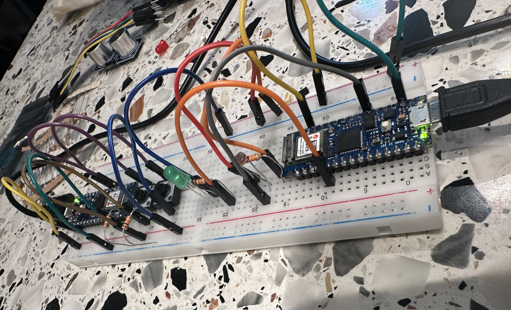

# Smart LED and Remote

💡 **A Smart LED System with Remote Control** for IoT Project

---

## 🛠️ Features

- **Smart LED Control**:  
  - ON/OFF and brightness adjustment with BLE commands.  
  - Automatic mode based on ambient light.  

- **Remote Control**:  
  - Buttons for ON and OFF (only 2 buttons used due to constraints).  
  - BLE communication with the Smart LED.  

- **BLE Integration**:  
  - `Service UUID`: `180A`  
  - `Characteristic UUID`: `2A57`

---

## 🚀 Implementation Steps

### **1. Smart LED (`smartled.ino`)**
- **Peripheral Device**:  
  - Contains an LED and light sensor.  
  - Responds to BLE commands to control LED state and brightness.  
- **Hardware Requirements**:  
  - LED (connected to pin `2`)  
  - Light sensor (connected to pin `A2`)  

### **2. Remote Control (`smartledremote.ino`)**
- **Central Device**:  
  - Sends commands to the Smart LED via BLE.  
- **Hardware Requirements**:  
  - 2 buttons for control (ON and OFF):  
    - ON (`2`), OFF (`3`)

---

## ⚙️ BLE Command Mapping

| **Button**       | **Command**  | **Action**                 |
|-------------------|--------------|----------------------------|
| OFF              | `0`          | Turn off LED              |
| ON               | `1`          | Turn on LED               |

---

## 💻 Example Commands

1. **Turn LED ON**  
   - Remote sends `1` to the LED via BLE.  
   - LED turns on.

2. **Turn LED OFF**  
   - Remote sends `0`.  
   - LED turns off.

---

## 📂 Submission

- `smartled.ino`  
- `smartledremote.ino`  
- Note: Only 2 switches (ON and OFF) were implemented due to hardware constraints.

---

## 📸 Preview

